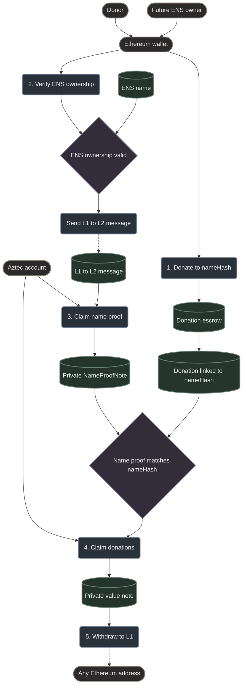

# Page 1

```mermaid
flowchart TB

    donor([Donor])
    owner([Future ENS owner])
    ethwallet([Ethereum wallet])
    aztecaccount([Aztec account])
    l1recipient([Any Ethereum address])

    donate(1. Donate to nameHash)
    verify(2. Verify ENS ownership)
    sendmessage(Send L1 to L2 message)
    claimproof(3. Claim name proof)
    claimdonation(4. Claim donations)
    withdraw(5. Withdraw to L1)

    ens[(ENS name)]
    escrow[(Donation escrow)]
    message[(L1 to L2 message)]
    proof[(Private NameProofNote)]
    donation[(Donation linked to nameHash)]
    balance[(Private value note)]

    valid{ENS ownership valid}
    proofvalid{Name proof matches nameHash}

    donor --> ethwallet
    ethwallet --> donate
    donate --> escrow
    escrow --> donation

    owner --> ethwallet
    ethwallet --> verify
    verify --> valid
    ens --> valid
    valid --> sendmessage
    sendmessage -.-> message

    aztecaccount --> claimproof
    message --> claimproof
    claimproof --> proof

    aztecaccount --> claimdonation
    proof --> proofvalid
    donation --> proofvalid
    proofvalid --> claimdonation
    claimdonation --> balance

    balance --> withdraw
    withdraw -.-> l1recipient

    classDef actor fill:#2C2A2A,stroke:#81766D,stroke-width:2px,color:#F4F1EE;
    classDef action fill:#29313A,stroke:#667789,stroke-width:2px,color:#EDF2F7;
    classDef state fill:#25342D,stroke:#678072,stroke-width:2px,color:#EAF4EC;
    classDef gate fill:#332D3A,stroke:#81728D,stroke-width:2px,color:#F1ECF5;

    class donor,owner,ethwallet,aztecaccount,l1recipient actor;
    class donate,verify,sendmessage,claimproof,claimdonation,withdraw action;
    class ens,escrow,message,proof,donation,balance state;
    class valid,proofvalid gate;
```
